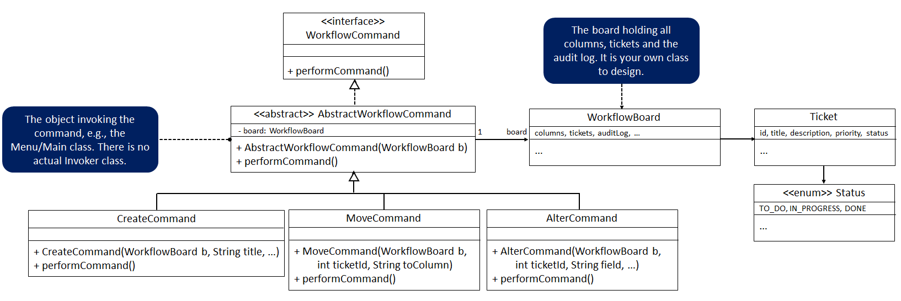

# Task 1: Workflow Commands


## Background
User stories are used in the Agile software development approach to describe a piece of functionality that needs to be developed as part of a larger system from the end user’s perspective. See more information about user stories and the Agile process [here](https://www.atlassian.com/agile/project-management/user-stories) and [here](https://agilealliance.org/glossary/user-stories/).

A user story can be logged using a ticket on a board that has columns representing different ticket states, for example To Do, In Progress and Done.

You can see an interactive example of a software development board [here](https://gemini.google.com/share/7e1779fd9b8c).

---

# Scenario

A newly-formed company called **ManageMyWorkflow** has asked you, as a junior software developer, to create a **workflow management system** to manage the states of user stories within a software development project.

Your task is to implement the **backend functionality** of this system using a **console menu–based Java application**.

---

# Requirements 

## Commands

You must implement code for the following commands:

| Command  | Description                                          |
|----------|------------------------------------------------------|
| Create   | Creates a ticket and adds it to the **To Do** column |
| Move     | Moves a ticket from one column to another column     |
| Alter    | Adds or edits specific information of a ticket       |

## Ticket States

Tickets can move between the following three states:

- **To Do**
- **In Progress**
- **Done**

Information must be stored for each ticket so that its **current state** in the system is always known.

## Ticket Information

A Ticket must store:

- id
- title
- description
- priority
- status

Statuses should be set using a public enum (i.e., Status.TO_DO, Status.IN_PROGRESS and Status.DONE) in the `workflow` package, but they can also be a String.

## Audit Log

You must implement an **audit log** that keeps a history of all commands performed in the system.

---

# Minimum Viable Product (MVP) Requirements

Implement the console-menu-based application as a minimal viable product (MVP) to show the stakeholders of your company. The MVP must include the following functionality:

1. **Audit Log Initialisation**  
   A data structure that is initially empty to represent the audit log.

2. **Command Execution**  
   All commands (Create, Move and Alter) must be supported.  
   The user must be able to specify details for each command, for example which column to move a ticket to or what information to update for a ticket.

3. **Multiple Commands per Ticket**  
   A single ticket may have **multiple commands performed on it**. Each command must be recorded as a **separate entry in the audit log**.   

4. **Debug Display**  
   After **every command**, display the contents of all columns for debugging purposes.

5. **Audit Log Display**  
   The system must allow the user to **display the full audit log**.

---

# UML Class Diagram

The design shown in the UML diagram below resembles the **Command Design Pattern** and you can find more information on this pattern [here](https://en.wikipedia.org/wiki/Command_pattern).

The Java classes in your solution **must match the following UML class diagram**:



> **Note:** The UML diagram **may not contain all fields and methods** required for the system, e.g., constructors, getters and setters. When a command is **created**, it is **not executed immediately**. To execute a command, the `performCommand()` method must be called.

---

# Getting Started

## Project Structure

```
src/
├── main/java/workflow/    ← Implement your classes here
└── test/java/workflow/    ← Automated tests (do not modify these tests)
```

### Important:
All your classes must be placed in the `workflow` package

## 1. Clone the Repository Using GitHub Desktop

1. Open **GitHub Desktop**.
2. Click **File → Clone Repository**.
3. Select the **URL** tab.
4. Paste the repository URL from your GitHub repository.
5. Choose a local folder where the project should be stored.
6. Click **Clone**.

The repository will now be downloaded to your computer.

---

## 2. Open the Project in IntelliJ IDEA

1. Open **IntelliJ IDEA**.
2. Click **Open** on the welcome screen.
3. Navigate to the folder where you cloned the repository.
4. Select the **project folder**.
5. Click **Open**. Select **Trust Project** if prompted. IntelliJ will import the project.
6. Create your Main class with a `main()` method

Remember that the project will not compile until you implement the required classes in the UML diagram. Use the provided tests files to understand the expected implementation.

### Note: You need to select 'Load Maven Project' to run the tests locally

Right-click on a test file in `src/test/java/workflow` to run specific tests.

You can also run the tests via the Maven Tool Window:
1. Open the Maven Tool Window: View -> Tool Windows -> Maven
2. Run: Double-click on Lifecycle -> test

---

# Expected Console Behaviour

The console menu interface should start, allowing you to perform commands such as:

- Create Ticket
- Move Ticket
- Alter Ticket
- View Board
- View Audit Log

After each command execution:

- The **ticket locations** should update accordingly.
- The **board columns** should be displayed.
- The **audit log** should store the command that was executed.

Example:

#### To Do:
[T1] Implement login feature

#### In Progress:
[T2] Design database schema

#### Done:
[T3] Setup project repository

---

# Grading

Your submission is automatically graded when you push to GitHub. The grading pipeline runs a series of automated tests against your code. You can check your results by visiting the Actions tab in your repository.

| Test         | Points | Description                              |
|--------------|--------|------------------------------------------|
| Structure    | 8      | Correct class hierarchy and interfaces   |
| Workflow     | 2      | Basic command functionality              |
| Hidden Tests | 20     | Additional undisclosed test cases        |
| **Total**    | **30** | Correct class hierarchy and interfaces   |

---

## Resources

- [Command Design Pattern](https://en.wikipedia.org/wiki/Command_pattern) — The pattern your solution must follow
- [Understanding GitHub Actions](https://docs.github.com/en/actions/learn-github-actions/understanding-github-actions) — How the automated grading pipeline works
- [JUnit 5 User Guide](https://junit.org/junit5/docs/current/user-guide/) — The testing framework used in this project
- [Maven in 5 Minutes](https://maven.apache.org/guides/getting-started/maven-in-five-minutes.html) — The build tool used in this project
- [User Stories (Atlassian)](https://www.atlassian.com/agile/project-management/user-stories) — What user stories are
- [User Stories (Agile Alliance)](https://agilealliance.org/glossary/user-stories/) — Agile methodology overview